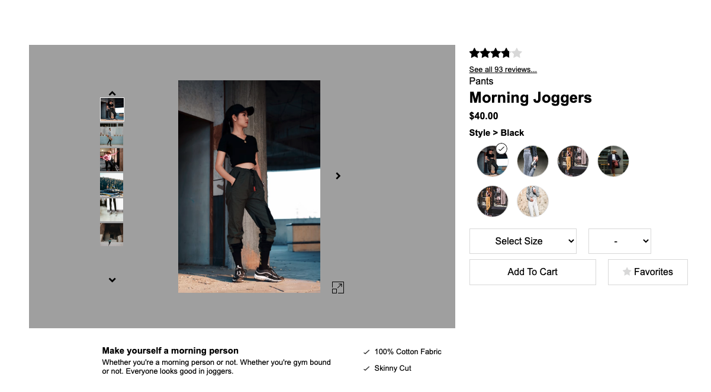
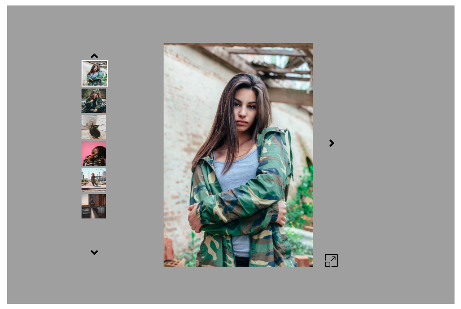
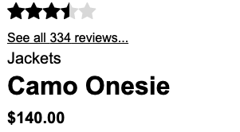
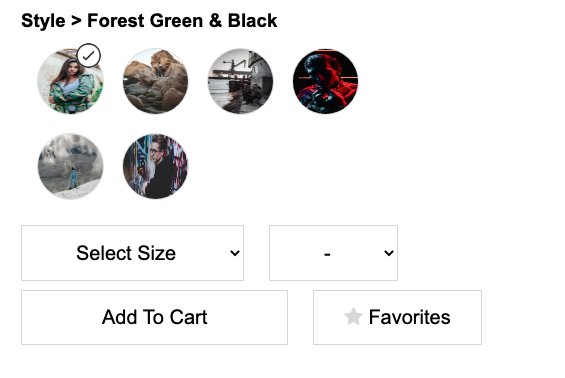
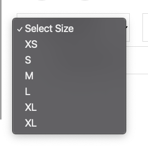
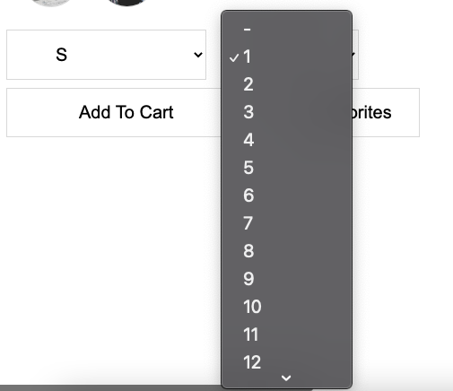
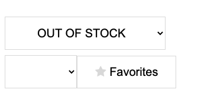

# Project Atelier

Project Atelier is a front-end overhaul of the retail portal for *the company*.
***

## Description

The highest-level features of Atelier are its three main modules: Product Overview, Related Products, and Ratings & Reviews. Each of these sections will be covered in greater detail by it's author later on. The quick breakdown is as follows:

Product Overview - Displays pictures of the product and it's related styles. Allows the user to select a size, quantity, and add their selection to cart.

Related Products - Displays a set of related products and allows the user to curate a list of products together into an "outfit".

Ratings & Reviews - Displays a list of user-submitted reviews of the current products. Allows users to write and submit their own reviews.

# Widget Breakdown

## Product Overview:

The overview component consists of a parent div enclosing four sub components that render the complete component. The parent component consists of many states that trigger sub component re-renders. The sub components are also passed down different methods that allow for customer interaction.

Image Gallery:

The image gallery sub component renders a centered 'main stage' image of a product's chosen style as well as thumbnail photos of a smaller size of different photos of the style. The thumbnails are interactive and when clicked update the main image to that thumbnail while highlighting the thumbnail photo on the side to indicate selection.

A product's style's photos can be beautifully displayed in this format. It also includes two different views, standard as well as expanded. Products can be zoomed in on and inspected.

Product Information:

The product information sub component displays the product's star rating, category, name, price, slogan, description and features. The information is neatly display along side the image gallery to highlight the product's awesome features.

Style Selector:

The style selector sub component displays the product's different styles. It provides a small thumbnail image that shows an introduction to the style. The thumbnail images are interactive and allow the user to change to another style with a simple click. This interacts with our image gallery as well and updates the style to the user's choosing.

Add to Cart:

The add to cart sub component displays the product's style's availability and allows the user to add the product to their cart or alternatively save the outfit to their favorites, or maybe both!

There are also buttons and selection menus for the product's different sizes and the specific size's quantity that are available.

If the product is out of stock then the selection menu will display a notification of it being out of stock.

## Related-Products description:
Related Prodouct widget is about display two lists with related products and you outfit list. Related products is the products that related with current detail page product, it's given by server and cannot been changed. You outfit list is the outfit that each user add to the list, it's only for the current user.
### List Behavior:
Related Products List will display all products related to current product as a card. It will include product image, category, name, price and star rating. By click on the card will navigate to the detail page of clicked product. The list will only display four cards in a row and with a next/last page botton on the side. The botton will only display when there is a next/last page. Also there's a action botton on the top right of each card, by click on this botton will display a comparison modal.

Your Outfit List will display same style of card as Related Products List, but there will be a "Add to Outfit" botton always display on the first card spot of list, by click on this botton will add current product to the outfit list. Also the action botton on the top right is different with related list, outfit botton will remove this clicked product from outfit list.

### Comparison Modal:
By click on the related products top right star icon botton will open a comparison modal. In this modal window will display the different feature characteristic between current product and related product. The name of product will always display on the top of modal, and if product have that characteristic will display checkmark or specific value of the characteristic, if product do not have those characteristic will leave blank with this characteristic.

## Usage:

### Related-Product

Click on the Related-Product card inside the list will doing a navigating the detail page to clicked product.

Click on the star icon of related products card will open comparison modal window.

Click on the cross icon on the top right of outfit card will remove this product from outfit list.

## Ratings & Reviews
**Review List** - The heart of the Ratings & Reviews widget is the review list. On page load, a complete list of user-submitted reviews for the current product page is fetched from the API. Only two reviews are initially listed however. When the user clicks "More Reviews", two more review tiles are loaded. Only one server request is necessary though, as all reviews have already been retrieved. The list can be sorted by relevant, newest, or most helpful. Sorting does trigger another call to the API.
***
**Review Tiles** - Each review tile contains all the information listed in the business requirements document: star rating, timestamp, a summary, a body, any images the user submitted as part of the review, an indicator of whether the reviewer recommends the product, the reviewer's name, and the helpfullness rating of the review. Users are able to mark a review as helpful by clicking "Yes". This can only be done once per user per review.
***
**Rating Breakdown** - The rating breakdown section calculates an average score out of all submitted ratings for the product and displays that average as a number.
***
**Product Breakdown** - The product breakdown section takes user-submitted feedback regarding relevant characteristics of a given product and creates an average score in the form of a number.
***
**Write New Review** - Clicking "Add A Review" at the bottom of the review list opens a modal window where a user will be asked to enter information relevant to their opinion of the product. Required fields are mark with an asterisk, and input validation prevents the form from being submitted if any of those fields are left empty. In addition to text, the user can submit up to five pictures to go along with their review. On upload, these pictures are added to Cloudinary, an image and asset hosting site. A public image url is returned upon successful upload, and is added to an array that is submitted to the API when the form is submitted.

